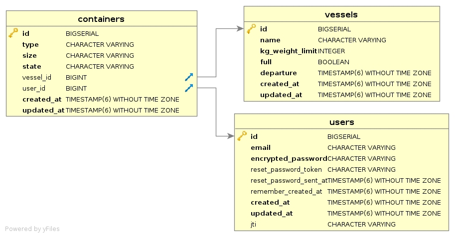

# Context
We are a shipping container booking company, our customers send us containers of different weight/type (example: REEFER20, DRY40). We need to save the containers received via the api as well as any changes to them. When the status of the containers changes to `:ready` it indicates that the container can be loaded on the vessel. Then, asynchronously, we calculate the total weight on the vessel being loaded and check if the loading limit has not been reached, if not, then the container can be loaded and its status changes to `:stuffed` In this case, we send an email to the customer, to inform him that his container has been loaded. If there are no more vessels available at the departure of the day, then we inform the customer that his container will be loaded the next day.

## 1st - Improve the ContainersController
The controller has been defined according to the most basic convention of rails. How could you improve this one?

## 2nd - Process asynchronously (optional)
Handle containers changes that go from `pending` to `ready` state

# What is provided in the project
- Rails api-only pre-configured (auth, spec...)
- User and Vessel models



## Constants
```ruby
Containers::STATES  # List of possible states
Containers::TYPES   # List of possible types (DRY, REEFER...)
Containers::SIZES   # List of possible sizes (20, 40...)
Containers::WEIGHTS # Mapping between type/size and weigth
```

## Mailers
```ruby
StuffingMailer.stuffed_today(container)             # To notify user for today stuffing
StuffingMailer.will_be_stuffed_tomorrow(container)  # To notify user for tomorrow
```

## Models
```ruby
# User
User.count
1

User.last
<User id: 1, email: "test1234@gmail.com", created_at: "2022-10-11 15:59:40.891978000 +0000", updated_at: "2022-10-11 15:59:40.891978000 +0000", jti: nil>

# Vessel
Vessel.count
3

Vessel.all
[
  <Vessel:0x00007fbf24e5ab10                                      
    id: 1,                                                          
    name: "Dickinson, Adams and Keeling",                           
    kg_weight_limit: 12500000,                                      
    full: false,                                                    
    departure: Tue, 11 Oct 2022 16:00:00.000000000 UTC +00:00,      
    created_at: Tue, 11 Oct 2022 15:59:42.155205000 UTC +00:00,     
    updated_at: Tue, 11 Oct 2022 15:59:42.155205000 UTC +00:00
  >,    
  <Vessel:0x00007fbf24f9bc18                                      
    id: 2,                                                          
    name: "Tillman, Stehr and Lesch",                               
    kg_weight_limit: 20500000,                                      
    full: false,                                                    
    departure: Wed, 12 Oct 2022 16:00:00.000000000 UTC +00:00,
    created_at: Tue, 11 Oct 2022 15:59:42.166003000 UTC +00:00,
    updated_at: Tue, 11 Oct 2022 15:59:42.166003000 UTC +00:00
  >,
  <Vessel:0x00007fbf24f9ba38
    id: 3,
    name: "Hermiston, Medhurst and Roberts",
    kg_weight_limit: 38000000,
    full: false,
    departure: Wed, 12 Oct 2022 18:00:00.000000000 UTC +00:00,
    created_at: Tue, 11 Oct 2022 15:59:42.177602000 UTC +00:00,
    updated_at: Tue, 11 Oct 2022 15:59:42.177602000 UTC +00:00
  >
]
```

# Setup

```shell
git clone git@github.com:buyco/hiring_challenges.git
cd hiring_challenges/ruby_challenge
make setup_and_start # or docker compose up -d --build && docker compose logs -f --tail=100
make console

# Happy challenge!
```
**Server on**
http://localhost:3000/health


